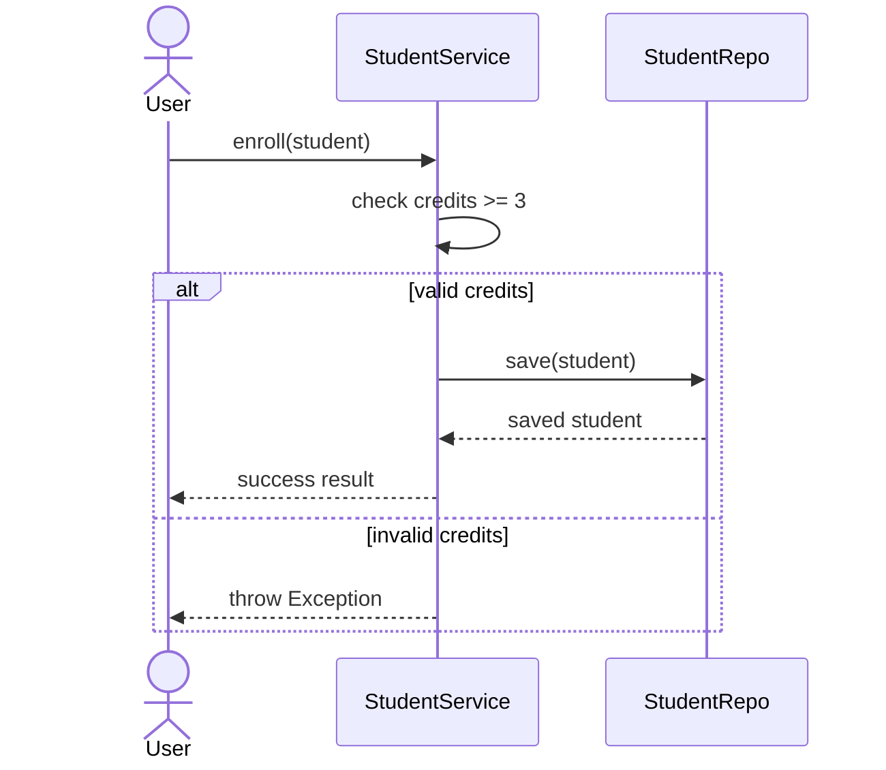
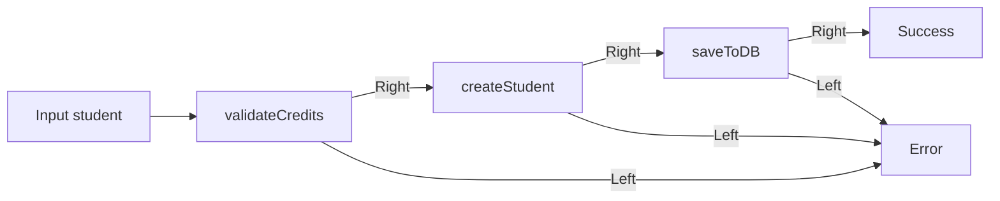

# Task 2 Diagrams

## OOP Sequence Diagram

```mermaid
sequenceDiagram
    actor User
    participant Service as StudentService
    participant Repo as StudentRepo

    User->>Service: enroll(student)
    Service->>Service: check credits >= 3
    alt valid credits
        Service->>Repo: save(student)
        Repo-->>Service: saved student
        Service-->>User: success result
    else invalid credits
        Service-->>User: throw Exception
    end
```

## FP Pipe Flow Diagram

```mermaid
flowchart LR
    A[Input student] --> B[validateCredits]
    B -->|Right| C[createStudent]
    B -->|Left| E[Error]
    C -->|Right| D[saveToDB]
    C -->|Left| E
    D -->|Right| F[Success]
    D -->|Left| E
```
