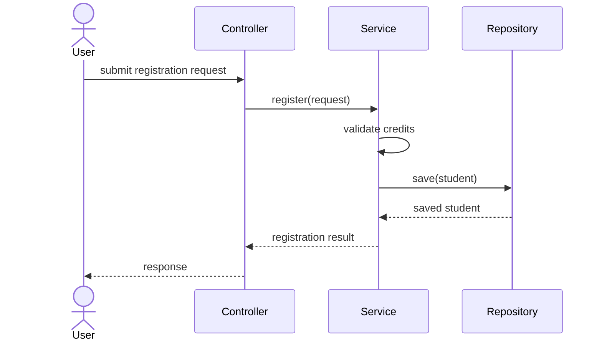
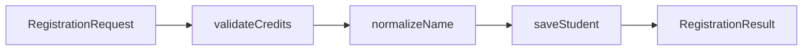

# Task 3 Mermaid Code

Paste the following code into Mermaid Live Editor.

## Sequence Diagram

## Data Flow Diagram

## Explanation

- The sequence diagram focuses on interaction between objects.
- The data flow diagram focuses on transformation steps.
- The TypeScript code in `src/main.ts` follows the same flow as the Mermaid diagrams.
